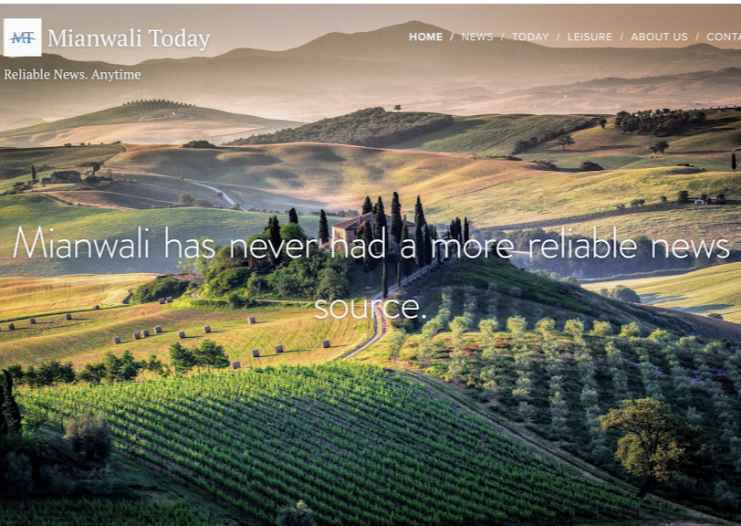

# mianwali-today
First-ever news website for Mianwali — local news &amp; exclusive COVID-19 tracker (Summer 2020).

# Mianwali Today — First Digital News Platform for Mianwali

**Summer 2020 — Founder, CEO & Developer:** *Asad Hasan Alvi*

Mianwali Today was the **first-ever local news and COVID-19 tracker** for the Mianwali District, Pakistan.  
Built as a **one-person initiative** during the early months of the COVID-19 pandemic, the platform provided real-time updates, local news, and safety information to thousands of residents — in collaboration with the district police.

---

## 📌 Key Achievements

- **First and only** online COVID-19 case tracker for Mianwali during the pandemic.
- 
- Over **1,100+ activities** (page views, shares, interactions).
- 
- Indexed on Google Search with **500+ searches** and **400+ views**.
- 
- Earned **26 detailed 5★ reviews** on Google Maps (rating 5.0).
- 
- Featured regular CEO press releases & update posts to engage the community.
- 
- Operated entirely as a **solo project** (content, design, development, and outreach).
- 
- Expanded over time with new features:
- Tourism section showcasing Mianwali’s cultural and natural sites.
- Weekly recap of local news for easy community catch-up.
- Full Urdu-language version to ensure accessibility for all residents.

- Operated entirely as a solo project (content, design, development, and outreach).

---

## 📰 Impact

- Provided **critical pandemic information** when no other local digital platform existed.
- Partnered with **district police** to share verified safety guidelines, news and official announcements.
- Promoted digital literacy by introducing many residents to their first local online news source.
---

## COVID-19 Tracker

During the pandemic, Mianwali Today provided the district’s only COVID-19 case tracker, updated daily using verified district health data (source: District Headquaters Hospital, Mianwali)
(Archived copy not available; see testimonials and press releases for user impact.)

---

## 💻 Technology

- Built using **Webnode** website builder. (Now inactive)
- Simple, mobile-friendly design for accessibility across devices.
- Separate Urdu-language site created to allow access for even more people.

---

## 📷 Screenshots

| Homepage | Update Summary of First Major Update | Google Reviews |
|----------|-----------------|----------------|
|  |  |  |

---

## 📄 Additional Material

- [Website Update Presentation](presentation/mianwali-update.pdf)
- [Case Study PDF](docs/mianwali-case-study.pdf)

---

## 📅 Timeline

- **August 2020** — Initial concept and planning.
- **August 2020** — Website launch with COVID-19 live tracker.
- **August–October 2020** — Regular updates, news articles, and community announcements.
- **September 2020** - Launched Urdu Website
- **October 2020** — Project concluded after founder’s relocation from Mianwali.

---

## Created by Asad Hasan Alvi
GitHub: [github.com/your-username](https://github.com/asadhasanalvi)

> *Mianwali Today was more than a news site — it was a lifeline for a community during an unprecedented crisis.*
